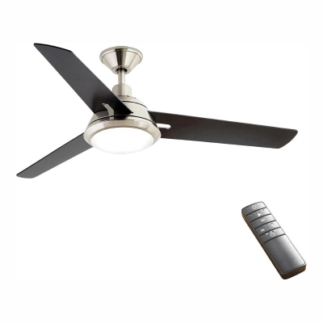
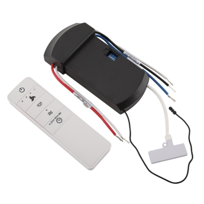
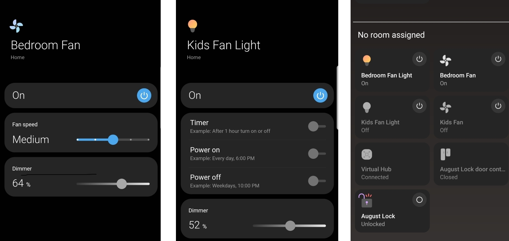
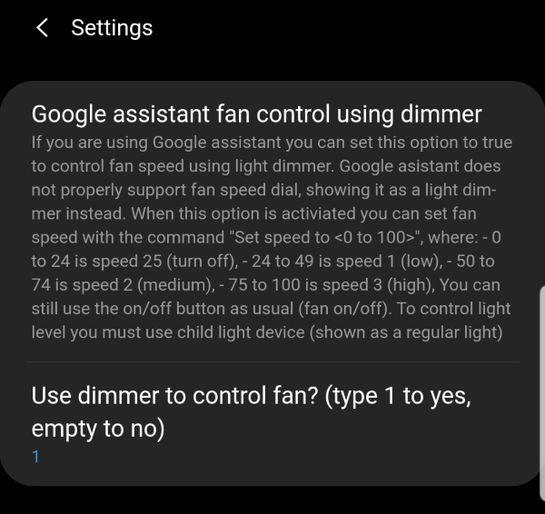
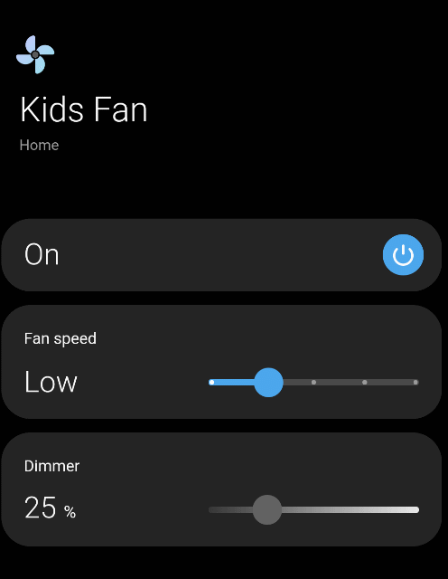
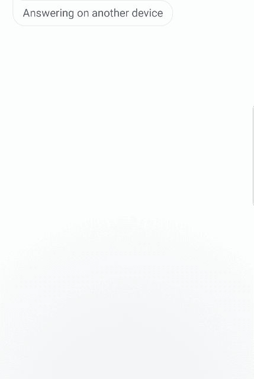

# Smartthings King Of Fans Zigbee device handler
Smartthings device handler for Home Depot Home Decorators Zigbee Fan (and fan controller) produced by King of Fans or Hampton Bay Universal Wink Enabled White Ceiling Fan Premier Remote Control. This device handler is based on  https://github.com/dcoffing/KOF-CeilingFan, refactored to work with new Smartthings app and to provide simpler user experience.

You can find the complete fan (including the controller) on the following links:

This device handler has a main device for Fan Control and a child device for light control

### Google Assistant fan Control

If you are using Google assistant you can set option dimmerAsFanControl to true to control fan speed using light dimmer.
Google asistant does not properly support fan speed dial, showing it as a light dimmer instead. When this option is activiated you can set fan speed with the command in Google Assistant as "Set <FAN NAME> speed to <0 to 100>", where:
  - 0 to 24 is speed 25 (turn off),
  - 24 to 49 is speed 1 (low),
  - 50 to 74 is speed 2 (medium),
  - 75 to 100 is speed 3 (high),
  

You can still use the on/off button as usual (fan on/off). To control light level you must use child light device (shown as a regular light)

  

Note that Google Home sees the fan dimmer as a "brightness", but the device handler respond as a fan control.

### Validation scenario 
This device handler was tested using Samsung Connect Home Pro (Smartthings V2 Hub) with Firmware version	000.027.00010 in a set up with +10 Zigbee devices. I used two King Of Fans, Inc. model HDC52EastwindFan at the same network.

### Known issues
- Random delays to update child device.
- Excess message logging and events generated
- Child light device shows as off-line

### Install Instructions

Follow [Smartthings Git Hub Integration Guide](https://docs.smartthings.com/en/latest/tools-and-ide/github-integration.html), using user rafaelborja and repository SmartthingsKingOfFansZigbee.

**Developer note: Please feel free to try Smartthings Git Hub Integration and validate if this issue is specific to my installation. **

You can also create a new device handler from code copying and pasting [child-contact-sensor device handler](devicetypes/rafaelborja/child-contact-sensor.src/child-contact-sensor.groovy) and [child-contact-sensor device handler]( devicetypes/rafaelborja/august-lock-pro-zwave-lock-with-doorsense.src/august-lock-pro-zwave-lock-with-doorsense.groovy) source code

### A note on https://github.com/dcoffing/KOF-CeilingFan

dcoffing made an amazing work with the legacy device handler https://github.com/dcoffing/KOF-CeilingFan. This device handler is not working with the new Smartthings app. For this reason I decided to make the needed changes and send PRs to contribute with the existing project, but unfortunately the project seems to be abandoned. 

This device handler has also a simplified interface and less child devices (no child devices for the fan, only one for the light).

This device handler would not be possible with all work and effort from dcoffing and all that contributed to the legacy device handler.

### FAQ
#### Why the fan buttons devices are gone?
A single 4 step slider is simpler to maintain and is already supported by most of voice assistants. If you would like to have, feel free to fork the project and send a PR. 

#### How can I use breeze function?
This functionality is not supported at the moment. 
